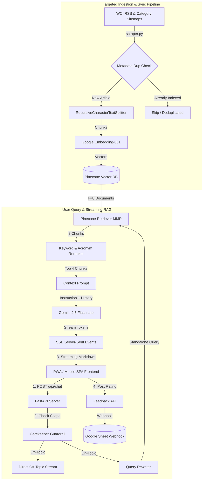

# 🩺 White RAG Investor

> *Financial wisdom for physicians still in the "rags" phase of their white-coat journey.*

**White RAG Investor** is a premium, AI-powered financial advisor chatbot designed specifically for medical residents and fellows surviving on a resident's salary while managing substantial student loan debt. The platform uses a customized **Retrieval-Augmented Generation (RAG)** pipeline to ground every answer in real articles from the [White Coat Investor](https://www.whitecoatinvestor.com/) (WCI) blog — distilling over a decade of physician-focused financial wisdom into actionable guidance.

### 💡 The Name Explained
- **RAG**: *Retrieval-Augmented Generation*, the AI architecture that retrieves relevant knowledge chunks to construct grounded, hallucination-free answers.
- **Rags**: A play on the "rags to riches" pathway, acknowledging that while medical training is highly prestigious, residents live in the "rags" phase of high debt and low trainee salaries.

---

## 🗺️ System Architecture



---

## ✨ Features

- **Personalized In-Context Onboarding**: Learns user specialty, PGY year, career goals, and family situation to tailor advice within the conversation.
- **High-Fidelity Knowledge Retrieval**: Searches over 80,000+ indexed vector chunks from targeted, high-value WCI categories.
- **Smart Keyword Re-Ranking**: Reranks vector retrieval results locally to boost key physician-specific financial acronyms (e.g., PSLF, SAVE, HSA, backdoor Roth).
- **Multi-Level Query Optimization**: Includes a topic guardrail classifier to filter off-topic prompts and a conversational query rewriter to handle follow-up contexts.
- **Inline Citations & Source Expander**: Embeds bracketed numbers `[1]`, `[2]` linking directly to an expandable sources drawer displaying titles, dates, excerpts, and URLs.
- **Dynamic Starters Generator**: Generates custom conversation starters on startup by sampling random financial article titles directly from the Pinecone vector index.
- **Interactive Loan vs. Investing Calculator**: A modal popup (accessible via the 📊 button in the chat header) that uses real amortization formulas to compare paying off student loans vs. investing in the stock market.
- **Mobile-Optimized PWA**: Installable standalone Progressive Web App experience featuring a modern dark-mode glassmorphic theme.
- **Self-Syncing & Deduplication**: Weekly background updates from WCI feeds, backed by file locks and metadata filters to avoid double-indexing.
- **Beta Feedback Webhook**: A thumbs-up/down widget connected to Google Sheets via Google Apps Script for tracking answer quality.

---

## 🛠️ Technology Stack

| Component | Technology | Description |
| :--- | :--- | :--- |
| **Frontend** | HTML5, Vanilla JS, CSS3 SPA | Responsive, mobile-first design, optimized for PWA. |
| **Backend** | FastAPI, Python 3.11+, Uvicorn | High-performance async API server with server-sent event (SSE) streaming. |
| **LLM Engine** | Google Gemini 2.5 Flash Lite | Temperature set to `0.0` to minimize hallucinations. |
| **Embeddings** | `models/gemini-embedding-001` | High-quality 3072-dimensional vector representations. |
| **Vector DB** | Pinecone Serverless | Hosted on AWS (`us-east-1`) for low latency vector retrieval. |
| **Orchestration** | LangChain (LCEL) | Manages embeddings, prompts, chains, and vector store configurations. |
| **Session Cache** | LangChain `InMemoryCache` | Prevents redundant API requests for identical queries within active sessions. |
| **Rate Limiter** | SlowAPI (Token Bucket) | Prevents API abuse; client-side caps questions at 25 per session. |

---

## 🧠 RAG & Search Logic Deep Dive

To produce highly accurate financial advice under tight context boundaries, the backend uses a sophisticated four-stage retrieval pipeline:

### 1. Topic Guardrail Classifier
Before querying the database, the prompt is classified by the LLM using a strict classification system. If the prompt falls outside WCI scope (e.g., recipes, code help, general trivia), the classifier immediately returns `OFF_TOPIC`, triggering a pre-defined warning and skipping the vector database search to conserve resources.

### 2. Conversational Query Rewriter
If there is existing conversation history, the follow-up prompt is rewritten to combine the historical context and the new question into a single standalone query (e.g., *"What about private ones?"* -> *"Should I refinance private student loans as a physician resident?"*). For the first question in a session, rewriting is skipped to save an API call.

### 3. Maximal Marginal Relevance (MMR) Retrieval
The vector store query uses MMR retrieval to optimize for both relevance and source diversity.
- **Initial fetch (`fetch_k=20`)**: Fetches 20 candidate document chunks using cosine similarity.
- **Diversity filter (`k=8`, `lambda_mult=0.5`)**: Selects 8 documents that balance relevance and redundancy, ensuring information is gathered from multiple articles.

### 4. Keyword Re-ranking & Acronym Boosting
The 8 retrieved chunks are reranked locally based on exact keyword density. The algorithm parses the user's query and assigns extra weight to critical financial acronyms:
* **Acronym Boost (5.0x)**: Matches on high-value terms: `pslf`, `roth`, `hsa`, `save`, `repaye`, `ira`, `pgy`, `401k`, `403b`, `529`, `backdoor`, `megabackdoor`.
* **Standard Term (1.0x)**: Matches on general alphanumeric terms.
* The top 4 ranked chunks after boosting are selected and formatted into the system context.

---

## 📊 Math Behind the "Loan vs. Investing" Calculator

Accessible via the calculator button (📊) in the chat header, this modal popup helps users visually compare the long-term benefit of using excess cash to pay down student loans vs. putting it in investment vehicles.

### 1. Loan Payoff Period
Given a loan balance ($B$), an annual loan interest rate ($r_l$), and a monthly extra payment amount ($P$), we define the monthly interest rate as $r_{lm} = \frac{r_l}{12}$.
The number of months required to pay off the loan, $M$, is calculated as:

$$M = -\frac{\ln\left(1 - \frac{B \cdot r_{lm}}{P}\right)}{\ln(1 + r_{lm})}$$

* **Edge Cases**:
  - If $r_{lm} = 0$, $M = \frac{B}{P}$.
  - If $P \le B \cdot r_{lm}$, the payment cannot cover the monthly interest, and the payoff period is flagged as **"Never"**.

### 2. Projected Investment Value
To find the opportunity cost of paying down the loan, we calculate the future value of investing that same monthly payment $P$ over the payoff period $M$ months, assuming a projected annual investment return ($r_i$). The monthly return is $r_{im} = \frac{r_i}{12}$.
The accumulated future value $FV$ is:

$$FV = P \cdot \frac{(1 + r_{im})^M - 1}{r_{im}}$$

* **Edge Case**:
  - If $r_{im} = 0$, $FV = P \cdot M$.

### 3. Verdict Logic
We compare the future value of investing ($FV$) against the total capital spent to pay off the loan ($C_{pay} = P \cdot M$, which includes both the principal and interest).
The net gain from investing is:
$$\text{Net Gain} = FV - C_{pay}$$
- If $\text{Net Gain} > 0$, **Investing** is flagged as the winning strategy (the market returns more than you'd spend on loan payments).
- If $\text{Net Gain} \le 0$, **Paying off the loan** is recommended (guaranteed interest savings outweigh projected market gains).

---

## 🔄 Data Ingestion, Sync & Deduplication

### Targeted Content Ingestion
To operate effectively within the Pinecone Free Tier (2 GB/100k vector limits), `scraper.py` avoids indexing general lifestyle, conference, or scholarship posts. It targets sitemaps matching specific financial keywords:
> `investing`, `insurance`, `disability`, `malpractice`, `student-loan`, `personal-finance`, `retirement`, `tax`, `estate-planning`, `asset-protection`, `real-estate`, `budgeting`, `debt`, `mortgage`, `401k`, `roth`, `hsa`, `contract`, `entrepreneurship`

### Safe Background Auto-Sync
Every time the FastAPI server starts, a background sync thread checks WCI RSS feeds for new posts.
- **Process Locking**: Uses `filelock` to create `auto_sync.lock`, preventing multiple server workers from initiating overlapping scraping tasks.
- **Interval Check**: Compares the current timestamp to `last_scrape_time.txt` to guarantee syncs occur at most once every 7 days.

### Vector Deduplication & Storage Guardrails
- **Metadata Filters**: Before vectorizing, a metadata query is sent to Pinecone matching the target URL filter. If vectors with the same source metadata exist, the article is skipped, protecting the index from duplicates across restarts or ephemeral container storage.
- **Ceiling Monitor**: A hard ceiling of **1.8 GB** is enforced (estimated as $\text{Vector Count} \times 12\text{ KB}$). If usage exceeds this, targeted scraping halts automatically to preserve index stability.

---

## 📈 User Feedback & Webhook Setup

The interface includes a thumbs up/down feedback widget. Selecting a button disables it and submits a POST request to `/api/feedback`, forwarding a payload to a Google Apps Script webhook:

```json
{
  "timestamp": "2026-06-03 11:35:56",
  "feedback": "positive",
  "answer_preview": "Based on WCI principles, residents should prioritize disability insurance...",
  "message_index": 1
}
```

### Google Apps Script Webhook Installation
1. Go to [Google Apps Script](https://script.google.com) and create a new project.
2. Replace the project contents with the code inside [feedback_webhook_template.gs](file:///g:/My%20Drive/White%20RAG%20Investor/feedback_webhook_template.gs).
3. Replace `YOUR_SPREADSHEET_ID_HERE` with your actual Google Sheet ID.
4. Click **Deploy > New deployment**.
   - **Select type**: Web app
   - **Execute as**: Me
   - **Who has access**: Anyone
5. Copy the deployment URL and add it to your environment variables as `FEEDBACK_WEBHOOK_URL`.
6. Ensure your target Google Sheet contains the following headers in row 1:
   `Timestamp | Feedback | Answer Preview | Message Index`

---

## 📂 Project Structure

```
├── main.py                 # FastAPI backend, routing logic, and background auto-sync
├── rag.py                  # RAG configurations, re-ranking, query rewriting, and guardrails
├── scraper.py              # Custom crawler, chunking parser, and Pinecone vector populator
├── requirements.txt        # Backend dependencies
├── processed_urls.json     # Local fallback cache tracking scraped WCI URLs
├── Dockerfile              # Docker container template for Hugging Face Space execution
├── feedback_webhook_template.gs  # Apps Script template for logging feedback to Google Sheets
├── last_scrape_time.txt    # Timestamp of the last successful background feed sync
├── static/                 # Static frontend SPA files served by FastAPI
│   ├── index.html          # Main interface (PWA meta tags, layout structure)
│   ├── style.css           # Glassmorphic responsive layouts & styling rules
│   ├── app.js              # SSE streaming parser, feedback triggers, and loan calculator math
│   ├── sw.js               # Service Worker caching assets for offline app launch
│   ├── manifest.json       # PWA installer specifications
│   └── app_logo.png        # Tattered white-coat visual identity icon
├── .env                    # Local environment secrets configuration (ignored in git)
└── .gitignore              # Protects secrets from version control
```

---

## 🚀 Quick Start

### Prerequisites
- Python 3.11+
- A Google Gemini API key from [Google AI Studio](https://aistudio.google.com/)
- A free Pinecone API key and database index from [Pinecone](https://www.pinecone.io/)

### Local Setup
1. **Clone the Repository:**
   ```bash
   git clone https://github.com/YOUR_USERNAME/wci-rag-advisor.git
   cd wci-rag-advisor
   ```

2. **Install Dependencies:**
   ```bash
   pip install -r requirements.txt
   ```

3. **Configure Environment Variables:**
   Create a `.env` file in the root directory:
   ```env
   GOOGLE_API_KEY="AIzaSyYourGeminiKey..."
   PINECONE_API_KEY="your-pinecone-api-key..."
   PINECONE_INDEX_NAME="wci-index"
   FEEDBACK_WEBHOOK_URL="https://script.google.com/macros/s/.../exec" # Optional
   ```

4. **Initialize Vector Store (Deep Scrape):**
   Run the deep scraper to discover categories, fetch relevant articles, chunk content, generate embeddings, and populate Pinecone.
   ```bash
   python scraper.py --deep
   ```

5. **Start Application:**
   Run the FastAPI dev server locally:
   ```bash
   python main.py
   ```
   Open your browser and navigate to `http://localhost:7860`.

---

## 🐳 Deploying to Hugging Face Spaces

1. Create a new Space on [Hugging Face](https://huggingface.co/new-space).
2. Choose **Docker** as the SDK and select the `Blank` template.
3. Commit and push the repository to your Hugging Face Space repository.
4. Navigate to Space **Settings** and add your secrets:
   - `GOOGLE_API_KEY`
   - `PINECONE_API_KEY`
   - `PINECONE_INDEX_NAME` (Default: `wci-index`)
   - `FEEDBACK_WEBHOOK_URL` (Optional)
5. Hugging Face will build the Docker container and host the app at its default port (`7860`).

---

## ⚠️ Disclaimer

This application is for **informational and educational purposes only**. It is not a certified financial planner, tax attorney, or medical professional. All advice is algorithmically derived from articles on the White Coat Investor blog. Users should verify critical financial decisions independently before acting.

*Built with ❤️ for the next generation of physicians.*
